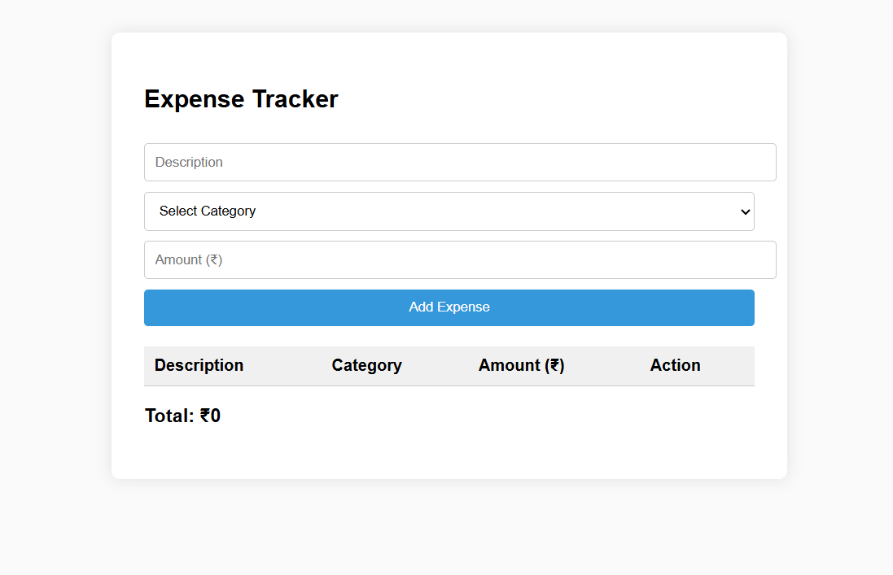

# 💸 Single-Page Expense Tracker

A responsive and beginner-friendly **Expense Tracker** 

---

## 🚀 Features

- 📝 Add an expense with **description**, **category**, and **amount**
- 📊 View all expenses in a **summary table**
- ❌ Delete individual entries with one click
- 🔢 See **live total** of expenses
- 🌐 Works completely offline and requires no server
- 📁 Entire logic + styling is inside a single `index.html`

---

## 🧪 Technologies Used

| Tech       | Purpose                    |
| ---------- | -------------------------- |
| HTML5      | Structure and layout       |
| CSS3       | Styling and responsiveness |
| JavaScript | DOM manipulation and logic |

---

## 📸 Screenshot

🧑‍💻 Author
Made with ❤️ by Sumit
Feel free to fork, enhance, and share!
